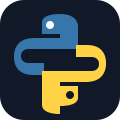

<div align="center">


<br>

[](https://github.com/kianfadaee448-alt)
[](https://github.com/kianfadaee448-alt/ChimiLab)
[](https://chimilab.ir)

</div>

---

## 👋 سلام! من کیانوش فدائی هستم

من یک **توسعه‌دهنده پایتون و سازنده پروژه‌های آموزشی** هستم که بیشتر از حفظ کردن تکنولوژی‌ها، به ساختن چیزهای واقعی علاقه دارم.

تمرکز اصلی فعلی من روی **ChimiLab** است؛ یک شبیه‌ساز آزمایشگاه شیمی که برای ترکیب برنامه‌نویسی، آموزش و شبیه‌سازی ساخته شده است.

> 🧪 **Build → Experiment → Learn → Improve**

---

## 🧰 Tech Stack

<div align="center">

<a href="https://www.python.org/"></a>
<a href="https://doc.qt.io/qtforpython/"></a>
<a href="https://www.sqlite.org/"></a>
<a href="https://developer.mozilla.org/en-US/docs/Web/HTML"></a>
<a href="https://developer.mozilla.org/en-US/docs/Web/CSS"></a>
<a href="https://github.com/"></a>

</div>

<p align="center">
  <sub>Python • PySide6 • SQLite • HTML • CSS • GitHub</sub>
</p>

---

## 🧪 Featured Project — ChimiLab

<a href="https://github.com/kianfadaee448-alt/ChimiLab">

</a>

**ChimiLab** یک شبیه‌ساز آزمایشگاه شیمی با تمرکز روی تجربه آموزشی و تعاملی است.

### ⚗️ What it does

- 🧪 شبیه‌سازی واکنش‌های شیمیایی
- 🔬 آزمایش‌ها و ابزارهای مجازی
- 📊 محاسبات و تحلیل داده‌های شیمیایی
- 🗃️ دیتابیس مواد و واکنش‌ها
- 🖥️ رابط گرافیکی با PySide6
- 🇮🇷 پشتیبانی از فارسی

**[→ مشاهده ChimiLab](https://github.com/kianfadaee448-alt/ChimiLab)**

---

## 📊 GitHub Activity

<div align="center">


<br><br>


</div>

---

## 🎯 Current Focus

```text
ChimiLab              ████████████████████  Building
Python                ███████████████████░  Advancing
Algorithms            ███████████████░░░░░  Learning
UI / UX               ██████████████░░░░░░  Improving
Chemistry Simulation  █████████████████░░░  Exploring
```

---

## 🌱 Goals

- 🚀 توسعه جدی‌تر ChimiLab
- 🧠 عمیق‌تر شدن در الگوریتم‌ها و ساختار داده
- 🧪 ساخت ابزارهای آموزشی علمی بیشتر
- 🎨 بهتر کردن UI/UX پروژه‌ها
- 🛠️ تبدیل ایده‌ها به پروژه‌های واقعی و قابل استفاده

---

## 📫 Find Me

<div align="center">

[](https://github.com/kianfadaee448-alt)
[](https://github.com/kianfadaee448-alt/ChimiLab)
[](https://chimilab.ir)

</div>

---

<div align="center">


### ⭐ Thanks for visiting my profile!


</div>
